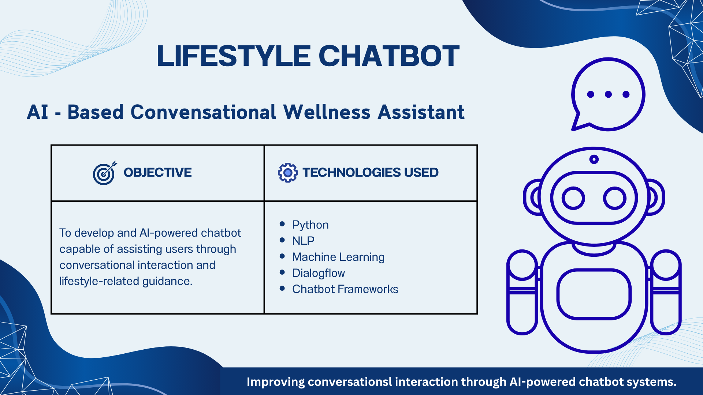
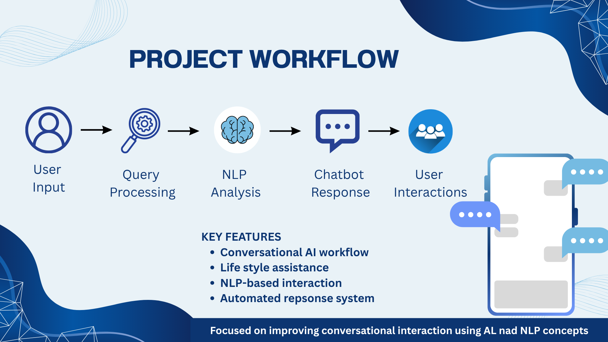

# Lifestyle Chatbot

## 🚀 Overview
Lifestyle Chatbot is an AI-based conversational assistant designed to support users through simple lifestyle and wellness-related interactions.
The project focuses on improving user interaction through chatbot-based communication and basic AI concepts.

## 🎯 Objective
To develop a chatbot system capable of assisting users through conversational interaction and lifestyle-related guidance.

## 🛠 Technologies Used
- Artifical Intelligence
- Chatfuel
- Facebook Messenger
- NLP Concepts
- Conversational AI Workflow Design

## 📊 Project Workflow
```text
User Input
   ↓
Query Processing
   ↓
NLP Analysis
   ↓
Chatbot Response
   ↓
User Interaction
```

## ✨ Key Highlights
- Conversational AI workflow
- Lifestyle Assistance
- Emotional-based interaction
- Automated response system
- User-friendly chatbot flow

## 📷 Project Presentation





## 📈 Output 
The project helped in understanding how chatbot systems improve conversational interaction through AI-based workflows and user-centered communication.

## 👩‍💻 Author
 
**Varsha Sundararaj**

Business Analytics Postgraduate @ Dublin Business School 

Aspiring Data Analyst | NLP | SQL | Python

## 🔗 Connect With Me
- LinkedIn: https://www.linkedin.com/in/varsha-sundararaj-40a463201
- GitHub: https://github.com/varshasundararaj-analytics
